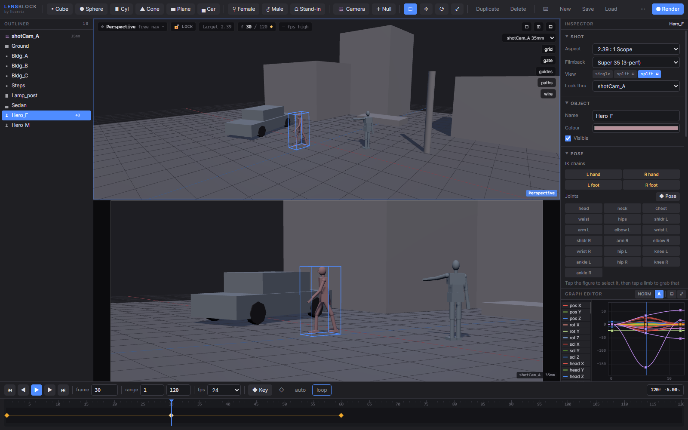

# LensBlock

**Previsualisation and 3D blockout in a single HTML file.**



*Split view: the free 3D perspective above, the shot camera's POV below, gated to
2.39:1 scope. The pose panel, animation curves and timeline update together.*

LensBlock is a browser-based previs tool for planning a shot before it is shot.
Block out a set with primitives, place posable stand-in actors, frame the action
through a camera with a real focal length and film back, animate it on a
timeline, and export the result to video.

It runs entirely on the client. three.js and its transform controls are compiled
into the page, so the application is one ~1 MB file that makes no network
requests, needs no build step and no server, and runs offline from a local disk
exactly as it does from this Space.

## What it does

- **Blockout primitives** — cube, sphere, cylinder, cone, plane, plus a
  parametric **car** (length / width / height, wheels on the floor). Every
  object is created with its pivot **on the ground**, so `y = 0` means standing
  on the floor and raising Height grows the object upward.
- **Posable figures** — female and male, 19 joints, anthropometrically correct
  proportions, ~1500 triangles. **No skinning and no skeleton** — a hierarchy of
  solid parts, like a wooden artist's mannequin. That is what makes it cheap
  enough to pose on a tablet with no graphics chip.
- **Three ways to pose, all live at once** — raw typed joint angles, FK on the
  rotate gizmo, and **IK** on four chains (L/R hand, L/R foot) with an analytic
  two-bone solver. Switching a chain to IK never moves anything: the goal snaps
  onto the limb and the pole twist is solved to reproduce the elbow or knee you
  already had. IK blend is a keyable 0–1 value, so a hand can let go of a prop
  mid-shot.
- **Cameras** — the camera name in the viewport corner is a picker: free
  perspective, a long-lens top view that reads as plan, or any shot camera in
  the scene with its focal length. A padlock (`L`) freezes the viewport, with a
  red frame so a view that will not move is never a mystery.
- **Animation** — keyframes on every channel including the full pose (a keyed
  figure carries ~86 curves), six interpolation modes, editable tangents, and a
  graph editor that docks under the shot or takes over the viewport.
- **Export** — render to video via WebCodecs / MediaRecorder.
- **Scenes** — save and load `.json`. Older files (v1–v3) migrate on load; an
  object of a kind the build does not know survives the round trip as a
  labelled box rather than being dropped.

## Controls

| | |
|---|---|
| Navigate | Maya-style — tumble / track / dolly |
| Touch | 1 finger tumble · 2 fingers track · pinch dolly · tap to select |
| Gizmos | `Q` `W` `E` `R` select / move / rotate / scale |
| Framing | `F` frame selected · `A` frame all |
| Keying | `S` keys the whole pose alongside the transform |
| Camera lock | `L` |

Tap a figure, then tap a limb, to grab that joint. Shortcuts key off physical
key position, so they survive Cyrillic, Greek, Hebrew and AZERTY layouts.

Below 900 px the Outliner and Inspector become drawers behind the buttons at the
ends of the top bar, so the viewport always keeps the full width — it stays
usable down to a 360 px phone.

## Run it offline

The whole application is this one file. Download it and double-click it —
it makes **zero network requests** and works on a machine that has never been
online.

```
https://huggingface.co/spaces/ilcaretz/lensblock/resolve/main/index.html
```

three.js r185 and TransformControls are embedded inline. You do not need
Node.js, Python, npm, or a local server.

## Requirements

A current browser with WebGL.

- **Verified** — Chrome, Edge and Brave, desktop and mobile emulation, down to
  360 px wide. 205 automated checks pass across seven viewport profiles, with
  zero uncaught exceptions and zero console warnings.
- **Expected** — Firefox and Safari. The CSS is guarded for both, but neither
  has been run for real. Treat them as untested rather than supported.

If you get a blank page, WebGL or hardware acceleration is off — check
`chrome://gpu`.

## Performance

Quality auto-tiers from the GPU (device pixel ratio, shadow map size,
anti-aliasing) and steps down on its own if frames stay slow. Set a tier by hand
in the `…` menu; it is remembered. The HUD reports **median** viewport frame
time over a 32-frame ring — the app renders on demand, so the frame after any
idle moment carries a shader compile and a mean would lie.

Losing the WebGL context (which a tablet does every time you switch tabs) is
caught and recovered, and the scene survives it. There is also an autosave to
browser storage — though it lives in one browser on one machine, so it does not
replace Save.

## Credits

Built by [ilcaretz](https://github.com/ilcaretz).
Bundles [three.js](https://threejs.org) r185 (MIT) — see
[THIRD_PARTY_NOTICES.md](THIRD_PARTY_NOTICES.md).
